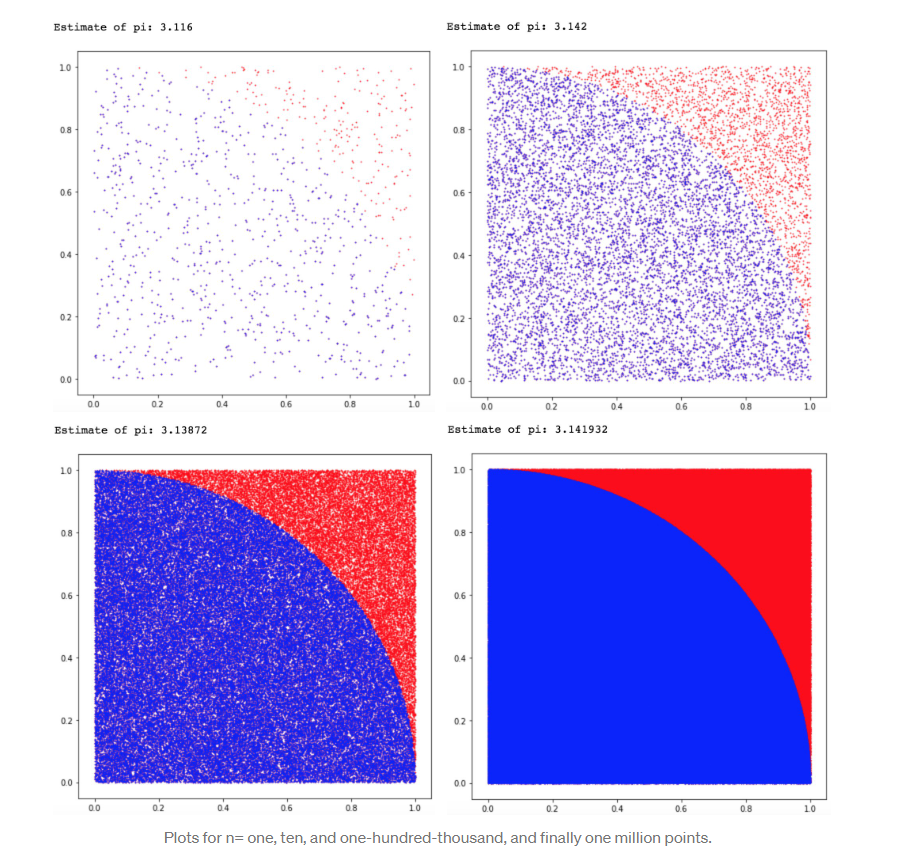

```{r, echo=FALSE, message=FALSE}
library(bayesrules)
library(rstan)
library(bayesplot)
```


# Introduction

Using Bayesian statistics we can incorporate prior knowledge into the estimation of our unknown parameters. In practice we incorporate our prior knowledge of the unknown parameter through a prior distribution. Then, we update our beliefs about $\theta$ with observed data and we will end up with what we call a posterior distribution. We can use the posterior to estimate the parameters of interest. There are different methods for when we can't sample from the posterior. This is when we use Markov Chain Monte Carlo (MCMC) techniques that approximate our target posterior. Gibbs sampling is a type of MCMC that uses conditional distributions to approximate a joint posterior distribution. This method is an alternative to Metropolis-Hastings. In a nutshell, Gibbs sampling is  a method that samples from separate conditional distributions and is most useful when the joint posterior distribution is unknown or hard to sample from. Each event is dependent on the last event; and it is only dependent on the last event (like in a standard Markov Chain).


# Motivation

Gibbs sampling is a useful algorithm for Bayesian estimation. We think that incorporating prior knowledge (priors) and data in the estimation of a parameter can be useful in different fields including quantitative finance and bio statistics. Some people might be familiar with the Metropolis-Hastings algorithm to implement a simulation and to sample our posterior distributions. Gibbs is a suitable alternative to Metropolis-Hastings depending on the information one has available. We were interested in the applications of Monte Carlo simulations in finance and also wanted to explore other Bayesian Statistics algorithms more deeply. 
	
# Background Knowledge

## Bayesian Statistics

Bayesian Statistics is a different philosophy of statistics. Most statistical modeling that people use are under the Frequentist school of thought. Frequentist methods depend only on the observed data. This means that interpretations and inference can only be from the sample that was studied or collected. Bayesian methods incorporate prior beliefs into the model before the data is received.

### Example 1

We have prior information regarding an upcoming election.
This first example shows how our priors affect posteriors in an election. Below we show for different priors for candidates. Aaron will be represented by alpha and Brynn will be represented by beta. 
We parameterize our priors in a beta distribution $Beta(\alpha,\beta)$ between [0,1]. Beta distributions are used to represent probabilities. 
Prior: A prior is a probability distribution that shows our beliefs before any data is taken into account. A common distribution used for a prior is a beta model. Priors incorporate both the mean and the variance of your previous beliefs about the data. Priors with a greater spread indicate a less confident belief.

### Prior: 
A prior is a probability distribution that shows our beliefs before any data is taken into account. A common distribution used for a prior is a beta model. Priors incorporate both the mean and the variance of your previous beliefs about the data. Priors with a greater spread indicate a less confident belief.

#### First Prior
$Beta(1,1)$ This is the same as the uniform distribution between [0,1]. We have no prior beliefs about how the election will take place. This is not realistic as it is always unlikely that someone will receive all of the votes or none of the votes.

```{r,out.width='40%',fig.align='center', echo=FALSE}
plot_beta(alpha = 1, beta = 1)
```

#### Second Prior
$Beta(10,10)$
In this case we believe that the election is close. The mean is centered at .5 probability. 
```{r,out.width='40%',fig.align='center', echo=FALSE}
plot_beta(alpha = 10, beta = 10)
```
#### Third Prior
$Beta(7,4)$
This prior favors Aaron. The mean probability is .64, with the mode at .67. This means that we have prior beliefs that Aaron will win the election.
```{r,out.width='40%',fig.align='center', echo=FALSE}
plot_beta(alpha = 7, beta = 4)

```

#### Fourth Prior
$Beta(4,7)$
This prior favors Brynn. The mean probability is .36, with the mode at .33. This means that we have prior beliefs that Brynn will win the election.

```{r,out.width='40%',fig.align='center', echo=FALSE}
plot_beta(alpha = 4, beta = 7)
```

### Likelihood: 
The likelihood function is the distribution of the data. In this example the outcome variable is binary on whether the person was voted for or not. So we have a binomial distribution of the likelihood. The graph below plots the density distribution of the binomial outcome. Aaron received 20 out of 30 votes in the exit survey we conducted $Y\mid \pi \sim Bin(30,\pi)$ where $\pi = 0.67$ given that he receive 20 out of 30 votes. 

```{r,out.width='40%',fig.align='center', echo=FALSE}
plot_binomial_likelihood(20,30)
```


### Posterior: 
The posterior is simply a combination of the prior and data. In this case we conveniently chose conjugate distribution in which the prior and posterior share the same distribution. We combine our data with our prior model to form the posterior distribution. As more data is incorporated more weight shifts to the data from the prior. 

Next we will incorporate the same data into their respective distribution and graph them. We will now use the exit survey to update our beliefs on the final result of the election.

### First Posterior
Since our prior is equivalent to a uniform distribution, our posterior is nearly identical to our data.

```{r,out.width='40%',fig.align='center', echo=FALSE}
plot_beta_binomial(alpha = 1, beta = 1, y = 20, n= 30)
```

### Second Posterior
Our data is favorable to Aaron in comparison to our priors, so the posterior falls between our data and our centered prior.
```{r,out.width='40%',fig.align='center', echo=FALSE}
plot_beta_binomial(alpha = 10, beta = 10, y = 20, n= 30)
```
### Third Posterior
Our data reinforces our prior that Aaron has around a .67 probability of winning.
```{r,out.width='40%',fig.align='center', echo=FALSE}
plot_beta_binomial(alpha = 7, beta = 4, y = 20, n= 30)
```

### Fourth Posterior
This represents our largest shift. Our prior favored Brynn, but with the significantly different data the posterior shifted towards Aaron.

```{r,out.width='40%',fig.align='center', echo=FALSE}
plot_beta_binomial(alpha = 4, beta = 7, y = 20, n= 30)
```

As these graphs illustrate, a change in our prior beliefs will affect the posterior, even with the same data.

## Monte Carlo
Monte Carlo simulations randomly sample points within a region to approximate a distribution. The example below is a simple illustration of a uniform distribution for an estimate for $\pi$. This samples the proportion of points within the square region that fall within the circle's bounds. The proportion would be equal to $\frac{\pi}{4}$ since we are only interested in one fourth of the circle. As we sample more, our estimation for $\pi$ gets closer to the actual distribution. This is due to the Central Limit Theorem. Monte Carlo simulations work well when the posterior distribution is easy to sample from. However, it is not always possible to sample from the posterior distribution, nor is it always efficient. 


This image illustrates a Monte Carlo simulation of 1/4 of circle to sample for $\pi$ [@Pease]. It is important to note some of the key qualities in this simulation. As n increases, the more accurate our simulation becomes. It is also important that the area that we are sampling from is known and easy to sample from. One reason we use MCMC sampling is because our distribution is hard to sample from. 


## Markov Chains

Markov Chains are an example of a random walk. Random walks are a series of random moves through space in succession. Random walks use a combination of past events in the probability to determine the next step. Markov Chains are a special case in which only the previous step/location is used to determine the probability distribution of the next step. The following notation represents this process $P(X_{n+1} = x | X_n = x_n)$ meaning the probability distribution of move n+1 is only conditioned on the result of the previous move n. It is important to talk about the fact that Markov Chains are dependent on the previous move and are not an independent event. 


## Gibbs Sampling Overview
Gibbs Sampling is a specific type of MCMC sampling that is used when it is hard to sample from the joint Probability Distribtutin Function (PDF) or Probability Mass Function (PMF) or when the joint PDF (or PMF) is unknown. To perform Gibbs sampling you must know the conditional distributions of both variables. 

### Markov Chains Monte Carlo (MCMC)

MCMC is the application of Markov Chains to simulate probability models. Two important characteristics are that MCMC samples aren't taken from the posterior pdf and that the samples aren't independent. The fact that the samples aren't independent reflects the "chain" feature of the algorithm. For example in the $N-length$ MCMC sample ( Markov chain) $\{\theta^{(1)},\theta^{(2)},...,\theta^{(N)}\}$, when constructing the chain, $\theta^{(2)}$ is drawn from some model that depends upon $\theta^{(1)}$, $\theta^{(3)}$ is drawn from some model that depends on $\theta^{(2)}$ and so on. 

We can say that the (i+1)st chain value $\theta^{(i+1)}$ has a conditional PDF $f(\theta^{(i+1)}|\theta^{(i)},y)$ is drawn from a model that depends on data y and the previous chain value $\theta^{(i)}$. It's important to note that by the Markov property, $\theta^{(i+1)}$ depends on the preceding chain values only through $\theta^{(i)}$, the most recent value. The only information we need to simulate $\theta^{(i+1)}$ is the value of $\theta^{(i)}$. Therefore, each value can be sampled from a different model, and none of these models are the target posterior. The pdf from which a Markov Chain value is simulated is not equivalent to the posterior pdf. 

$$f(\theta^{(i+1)}|\theta^{(i)}, y)\ne f(\theta^{(i+1)}| y)$$

We will conduct the MCMC simulation using the rstan package [@rstan]. There are two essential steps to all RSTAN analyses, first we define the Bayesian model structure and then simulate the posterior. It's important to note that RSTAN doesn't use Gibbs sampling, it uses a Hamiltonian algorithm, we are using this package to show how MCMC computation works. We will use a generic Beta-Binomial example: 

$$Y\mid \pi \sim Bin(10,\pi)$$
$$\pi \sim Beta(2,2)$$

Where Y is the number of successes in 10 independent trials. Each trial has a probability of success $\pi$ where our prior for $\pi$ is captured by a $Beta(2,2)$ model. If we observe 9 successes we have an updated posterior model of $\pi$ with distribution $Beta(11,3)$. Don't worry about how we found this answer for the moment being. Our goal is to run an MCMC algorithm to produce an approximate sample from the Beta-binomial posterior. 


### STEP 1: DEFINE the model

*Data*: Y is the observed number of success trials. We specify that Y is between 10 and 0. 
*Parameters*: The model depends on $\pi$, therefore we must specify that $\pi$ can be any real number from 0 to 1.
*Model*: We need to specify the model for the data and the model for the prior.

```{r, results='hide'}
# STEP 1: DEFINE the model
bb_model <- "
  data {
    int<lower = 0, upper = 10> Y;
  }
  parameters {
    real<lower = 0, upper = 1> pi;
  }
  model {
    Y ~ binomial(10, pi);
    pi ~ beta(2, 2);
  }
"
```

### STEP 2: Simulate the posterior

We simulate the posterior using the stan() function. This function designs and runs an MCMC algorithm to produce an approximate sample from the Beta-Binomial posterior. The model code argument requires a string that defines the model. The data argument requires a list of observed data. The chains argument specifies how many parallel Markov Chains we are running. Since we are running four chains we will have four $\pi$ values. The "iter' argument specifies the number of iterations or length for each chain. The first half of this iterations are thrown out as "burn in" samples (samples that we use to calibrate our model). To keep our random results constant we utilize the seed argument within the stan() function. 

```{r, echo=FALSE, results='hide'}
bb_sim <- stan(model_code = bb_model, data = list(Y = 9), 
               chains = 4, iter = 5000*2, seed = 84735)
```

As you can see in Figure 1, when observing the distribution of the sampled $\pi$ values we approximate the target Beta(11,3) posterior model of $\pi$. The target pdf is next to it [@Alicia]. 

```{r, fig.width=2, fig.height= 2, fig.align='center'}
# Histogram of the Markov chain values
mcmc_hist(bb_sim, pars = "pi") + 
  yaxis_text(TRUE) + 
  ylab("count")
# Density plot of the Markov chain values
p = seq(0, 1, length=100)
mcmc_dens(bb_sim, pars = "pi") + 
  yaxis_text(TRUE) + 
  ylab("density")+
  stat_function(fun = dbeta, args = list(11, 3)) 
```

# Metropolis-Hastings algorithm

If we weren't able to recognize the posterior model of $\mu$ in a Normal-Normal model, we could approximate it using the MCMC simulation. Metropolis-Hastings algorithm helps automate the decision of what values of $\mu$ to sample and with what frequency. This algorithm iterates through a two step process. If we are in the location $\mu^{(i)} = \mu$ we select the next value to sample first by proposing a random location $\mu^{\prime}$ and then we decide whether to stay at the current location or to stay at the current location $\mu^{(i+1)} = \mu$. 

There are special cases of the Metropolis-Hastings that involve a different sampling decision criteria such as Gibbs sampling, Hamiltonian, the Monte Carlo and the Metropolis algorithms. In this report we will be focusing on the Gibbs Sampling algorithm. 


# Gibbs Sampling

### Example 1: Bernoulli Distribution: 


We use Gibbs sampling to approximate a posterior for a joint distribution. As we will demonstrate later, we reduce our problem to calculations that only involve one parameter at the time. This is more efficient than trying to find the real posterior. We start with an example of two random variables $x, y$ with a Bernoulli distribution [@Lambert]. 
We now find their conditional distributions. This process is a simplified version of what is done in all forms of Gibbs Sampling. By understanding the steps below, one will be able to understand the concepts behind more complex distributions.

$$P(x|y = 0) \in P(x=1) = \frac{4}{5} \space , P(x = 0) = \frac{1}{5} $$

$$P(x|y = 1) \in P(x=1) = \frac{2}{5} \space , P(x = 0) = \frac{3}{5} $$
$$P(y|x = 0) \in P(B=1) = \frac{3}{4} \space , P(y = 0) = \frac{1}{4} $$

$$P(y|x = 1) \in P(y=1) = \frac{1}{3} \space , P(y = 0) = \frac{2}{3} $$

1. Pick specific starting value of $(x_0,y_0)$ 
Here we pick $(x=0),(y=0)$
2. Condition on $y_0$
3. Your distribution is now $P(x=0) = 1/5$ and $ P(x= 1) = 4/5$. This is based on the conditional distribution for $x=0$.
4. Randomly sample
5. Your random sample leads to $x=1$
6. Condition on $x_1$
7. Your distribution is now $P(y=0) = 2/3$ and $ P(y=1) = 1/3$. This is based on the conditional distribution of $x=1$.
8. Randomly sample
9. Your random sample leads to $y=1 $
10. Condition on $y_1$
Now the process repeats thousands of times until and each move is recorded. 
This algorithm then approximates well the true probability distribution after thousand of trials. More trials will lead to a better approximation.


### Example 2: Normal Distribution 


Now suppose we have data from a normal distribution where both the mean **and** variance are unknown. For convenience, we'll parameterize this model in terms of the *precision* $\gamma = \frac{1}{\sigma^2}$ instead of the variance $\sigma^2$. 

$$Y \mid \mu, \gamma \sim N\left(\mu, \frac{1}{\gamma}\right)$$

Suppose we put the following *independent* priors on the mean $\mu$ and precision $\gamma$:

$$\mu \sim N(m, v)$$

$$\gamma \sim \text{Gamma}(a,b)$$

We can start writing down the joint posterior distribution for $\mu, \gamma$. 


$$
\begin{aligned}
g(\mu,\gamma \mid y) & \propto f(y \mid \mu, \gamma) f(\mu, \gamma) \\
& = f(y \mid \mu, \gamma) f(\mu) f(\gamma), \text{ since } \mu, \gamma \text{ independent} \\
& = \left[(2\pi)^{-\frac{1}{2}}\gamma^{\frac{1}{2}}e^{-\frac{1}{2}\gamma(y - \mu)^2} \right] \left[(2\pi v)^{-\frac{1}{2}}e^{-\frac{1}{2v}(\mu - m)^2} \right]\left[\frac{b^a}{\Gamma(a)} \gamma^{a-1}e^{-b\gamma}\right]\\
& \propto \gamma^{\frac{1}{2}}e^{-\frac{1}{2}\gamma(y - \mu)^2}e^{-\frac{1}{2v}(\mu - m)^2}\gamma^{a-1}e^{-b\gamma}\\
& =\gamma^{\frac{1}{2} + a - 1}e^{-\frac{1}{2}\gamma(y - \mu)^2 + -\frac{1}{2v}(\mu - m)^2 -b\gamma} \\
& = \gamma^{\frac{1}{2} + a - 1}e^{-\frac{1}{2}\left[\gamma(y - \mu)^2 + \frac{1}{v}(\mu - m)^2 + 2b\gamma\right]} \\
& = \gamma^{\frac{1}{2} + a - 1}e^{-\frac{1}{2}\left[\gamma y^2 - 2\mu y \gamma + \gamma \mu^2 + \mu^2 / v - 2m \mu / v + m^2 / v + 2 b \gamma\right]} \\
& = \gamma^{\frac{1}{2} + a - 1}e^{-\frac{1}{2}\left[\gamma (y^2 + 2b) - 2\mu (y \gamma + m/v) + \mu^2(\gamma  + 1 / v)  + m^2 / v \right]} \\
& \propto \gamma^{\frac{1}{2}+a-1}e^{-\frac{1}{2}\left[\gamma(y^2 + 2b) - 2\mu(y\gamma + \frac{m}{v}) + \mu^2(\frac{1}{v}+ \gamma) \right]} \\
\end{aligned}
$$


We can see this doesn't look like a recognizable probability distribution. Therefore, we can't use our usual techniques here to find Bayes estimators for $\mu$ or $\gamma$ since we don't have a recognizable posterior distribution. Instead, we'll use *Gibbs Sampling* to generate samples from this posterior distribution. In order to perform Gibbs Sampling, we need to find the conditional distributions $$g(\mu \mid y, \gamma) \propto f(y \mid \mu, \gamma)f(\mu)$$ $$g(\gamma \mid y, \mu) \propto f(y \mid \mu,\gamma)f(\gamma)$$. 

We will use these conditional distributions to sample from the joint posterior $g(\mu, \gamma \mid y)$ according to the following algorithm:

> (1) Start with initial values $\mu^{(0)}, \gamma^{(0)}$.
> (2) Sample $\mu^{(t+1)} \sim g(\mu \mid y, \gamma = \gamma^{(t)})$.
> (3) Sample $\gamma^{(t+1)} \sim g(\gamma \mid y, \mu = \mu^{(t+1)})$.
> (4) Repeat many times.
It turns out that the resulting $\mu^{(0)}, \mu^{(1)}, \dots, \mu^{(N)}$ and $\gamma^{(0)}, \gamma^{(1)}, \dots, \gamma^{(N)}$ are samples from the joint posterior distribution $g(\mu, \gamma \mid Y)$, and we can use these sampled values to estimate quantities such as the posterior mean of each parameter $\hat{E}(\mu \mid y) = \frac{1}{N}\sum_{i=1}^N \mu^{(i)}, \ \ \hat{E}(\gamma \mid y) = \frac{1}{N}\sum_{i=1}^N \gamma^{(i)}$. Note that in practice we typically remove the initial iterations, known as the "burn-in" period: e.g., $\hat{E}(\mu \mid y) = \frac{1}{N-B}\sum_{i=B}^N \mu^{(i)}$.

To use this conditional distributions, first we need to show that the conditional distributions $g(\mu \mid y, \gamma), g(\gamma \mid y, \mu)$ are proportional to $f(y \mid \mu, \gamma)f(\mu), f(y \mid \mu,\gamma)f(\gamma)$, respectively, as stated above.

$$
\begin{aligned}
g(\mu \mid y, \gamma) &= \frac{f(\mu, y, \gamma)}{f(y, \gamma)} \\
& \propto f(\mu, y, \gamma), \text{ since } f(y, \gamma) \text{ doesn't depend on } \mu \\
& = f(y \mid \mu, \gamma) f(\mu, \gamma) \\
& = f(y \mid \mu, \gamma) f(\mu) f(\gamma), \text{ since } \mu, \gamma \text{ independent} \\
& \propto f(y \mid \mu, \gamma) f(\mu), \text{ since} f(\gamma) \text{ doesn't depend on } \mu
\end{aligned}
$$

A similar argument can be used to show $g(\gamma \mid y, \mu) \propto f(y | \mu, \gamma) f(\gamma)$.


Next we can use this result to show that $\mu \mid y, \gamma \sim N\left(\frac{y\gamma + \frac{m}{v}}{\gamma + \frac{1}{v}}, \left[\gamma + \frac{1}{v} \right]^{-1}\right)$ and $\gamma \mid y, \mu \sim \text{Gamma}\left(\frac{1}{2} + a, \frac{1}{2}(y-\mu)^2 + b\right)$.

$$
\begin{aligned}
g(\mu \mid y, \gamma) &\propto f(y \mid \mu, \gamma)f(\mu) \\
&= \left[(2\pi)^{-\frac{1}{2}}\gamma^{\frac{1}{2}}e^{-\frac{1}{2}\gamma(y - \mu)^2} \right] \left[(2\pi v)^{-\frac{1}{2}}e^{-\frac{1}{2v}(\mu - m)^2} \right]\\
& \propto e^{-\frac{1}{2}\gamma(y - \mu)^2 -\frac{1}{2v}(\mu - m)^2} \\
& = e^{-\frac{1}{2}\gamma(y^2 - 2\mu y + \mu^2) -\frac{1}{2v}(\mu^2 - 2\mu m + m^2)} \\
& \propto e^{-\frac{1}{2}\gamma(- 2\mu y + \mu^2) -\frac{1}{2v}(\mu^2 - 2\mu m)} \\
& = e^{-\frac{1}{2}\left[\mu^2(\gamma + \frac{1}{v}) - 2\mu(y \gamma + \frac{m}{v})  \right]} \\
& = e^{-\frac{1}{2}(\gamma + \frac{1}{v})\left[\mu^2 - 2\mu \left(\frac{y \gamma + \frac{m}{v}}{\gamma + \frac{1}{v}}\right)  \right]} \\
& \propto e^{-\frac{1}{2}(\gamma + \frac{1}{v})\left[\mu^2 - 2\mu\left(\frac{y \gamma + \frac{m}{v}}{\gamma + \frac{1}{v}}\right) + \left(\frac{y \gamma + \frac{m}{v}}{\gamma + \frac{1}{v}}\right)^2 \right]} \\
& = \propto e^{-\frac{1}{2\left(\gamma + \frac{1}{v}\right)^{-1}}\left[ \mu - \left(\frac{y \gamma + \frac{m}{v}}{\gamma + \frac{1}{v}}\right) \right]^2}
\end{aligned}$$

$$\implies \mu \mid y, \gamma \sim N\left(\frac{y\gamma + \frac{m}{v}}{\gamma + \frac{1}{v}}, \left[\gamma + \frac{1}{v} \right]^{-1}\right)$$


$$
\begin{aligned}
g(\gamma \mid y, \mu) &\propto f(y \mid \mu, \gamma)f(\gamma) \\
& = \left[(2\pi)^{-\frac{1}{2}}\gamma^{\frac{1}{2}}e^{-\frac{1}{2}\gamma(y - \mu)^2} \right] \left[\frac{b^a}{\Gamma(a)} \gamma^{a-1}e^{-b\gamma}\right]\\
& \propto \gamma^{\frac{1}{2}}\gamma^{a-1}e^{-\frac{1}{2}\gamma(y - \mu)^2}e^{-b\gamma} \\
& = \gamma^{\frac{1}{2} + a - 1}e^{-\frac{1}{2}\gamma(y - \mu)^2 -b\gamma} \\
& = \gamma^{\frac{1}{2} + a - 1}e^{-\gamma\left(\frac{1}{2}(y - \mu)^2 +b\right)} 
\end{aligned}$$


$$\implies \gamma \mid y, \mu \sim \text{Gamma}\left(\frac{1}{2} + a, \frac{1}{2}(y-\mu)^2 + b\right)$$

Suppose that we choose the following hyperparameters for our prior distributions---$m = 0, v = 1, a = 1, b = 1$---and that we observe $y = 2$. We can implement this Gibbs Sampler using the following code.

```{r gibbs-setup, echo = T}
# set up priors
m <- 0
v <- 1
a <- 1
b <- 1
# set up data
y <- 2
# choose starting values by randomly sampling from our priors
# (this is just one possible way to choose starting values)
# (it's also useful to try out a few different starting values)
set.seed(1)
mu <- rnorm(1, mean = m, sd = sqrt(v))
gam <- rgamma(1, shape = a, rate = b)
# set up empty vectors to store samples
mus <- c()
gams <- c()
# store starting values in vectors of samples
mus[1] <- mu
gams[1] <- gam
```

```{r run-gibbs, echo = T}
# choose number of iterations
# (we'll start with 1000, but in practice you'd choose something much bigger)
N <- 1000
# run through Gibbs Sampling for a total of N iterations
for(i in 2:N){
  # update mu
  m1 <- y*gam + m/v
  m2 <- gam + 1/v
  mu <- rnorm(n = 1, mean = (m1)/(m2), sd = sqrt(1/m2))
  
  # update gamma
  g1 <- 0.5 + a
  g2 <- 0.5*(y-mu)^2 + b
  gam <- rgamma(n = 1, shape = g1, rate = g2)
  
  # store new samples
  mus[i] <- mu
  gams[i] <- gam
}
```

Next we can look at a histogram of our posterior samples for $\mu, \gamma$ and $\sigma^2 = \frac{1}{\gamma}$. This shows what values of our parameters we sampled the most in our chain, and if we superimposed the posterior distribution, we would see the plausibility represented on these histograms are proportional to the plausibility of the real posteriors. 

```{r histograms, echo = F, fig.height = 3}
par(mfrow=c(1,3))
hist(mus, xlab = expression(mu), main = '')
hist(gams, xlab = expression(gamma), main = '')
hist(1/gams, xlab = expression(paste(sigma^2,'=',1/gamma)), main = '')
```

Next we create a *trace plot* to show the behavior of the samples over the $N$ iterations.


```{r trace-plots, echo = F, fig.height = 3}
iterations <- 1:N
par(mfrow=c(1,3))
plot(mus ~ iterations, xlab = 'Iteration', ylab = expression(mu), type = 'l')
plot(gams ~ iterations, xlab = 'Iteration', ylab = expression(gamma), type = 'l')
plot(1/gams ~ iterations, xlab = 'Iteration', ylab = expression(sigma^2), type = 'l')
```

Trace plots show the values from which the algorithm sampled from by iteration. It's like a tour around the different values of our parameters where we spend most time visiting values that are more plausible in our posterior. Successful trace plots cover the range of values in our distributions. It is important that trace plots are not stuck on one value, otherwise the distribution will not be accurate. Trace plots can best be described as a tour of a neighborhood. One does not want to be stuck in one location. To get the correct distribution, the markov chain should spend the most time in the locations that are most plausible. 

Next, once we have evaluated whether our approximate distribution is proportional to our posterior we can estimate different measurements to understand better our target posterior. In this case we calculate the mean and median of $\mu$.

```{r posterior-summaries, echo = T}
# posterior mean
mean(mus)
# posterior median
median(mus)
```


As mentioned above, in practice we usually pick a burn-in period of initial iterations to remove. This decision is often motivated by the fact that, depending on your choice of starting value, it may take awhile for your chain of samples to look like it is "mixing" well. Play around with your choice of starting value above to see if you can find situations in which a burn-in period might be helpful. 

# Discussion

### Gibbs Sampling vs Hamiltonian Sampling

One of the most difficult aspects in Gibbs sampling is finding the conditional distributions for our parameters. As shown in the Normal-Normal example previously explained, it was difficult to work with 2 unknown parameters, it's clear that working with more than two unknown parameters would be even more troublesome. Additionally, sampling from more than 2 different conditional distributions and alternating between them makes the computation for this algorithm highly expensive. Because of efficiency, people have started opting for Hamiltonian sampling instead. This is reflected on the discussion on whether to use the RSTAN or RJAGS packages, where RSTAN employs a Hamiltonian algorithm and RJAGS uses a Gibbs algorithm. When comparing both algorithms model specification matters. Furthermore, RJAGS performs better when we use conjugate priors while RSTAN performs better when we have a non-centered specification and partly and non-conjugate models. RSTAN tends to be better at exploring complicated posterior distributions while RJAGS can be very fast for problems with specific characteristics. Overall, RSTAN provides the best performance [@Bolstad].

### Real World Application

As mentioned earlier, Gibbs sampling is particularly useful when dealing with a multivariate posterior distribution and when we work with conjugate priors. This example shows how Gibbs sampling is effective when dealing with multivariate genetic models, where it's particularly difficult to find a posterior and where reducing our problem to calculations that involve only one parameter at the time simplifies our work significantly. 

Gibbs sampling has been used in the inference of population structure using multilocus genotype data [@Pritchard]. In other words, to infer the population of an individual using their genetic information. I will start defining some of the most important terms in the paper. A locus is the specific physical location of a gene or other DNA sequence on a chromosome, like a genetic street address. A genotype is the pair of alleles inherited from each parent for a particular gene, where an allele is a variation of a gene and a gene is the functional unit of heredity. For example, if a gene contains information on hair color one allele might code for brown and other for blond, a genotype would be the pair of alleles one coded for brown and the other for blond hair located at a specific locus. 

Assuming that each population is modeled by a characteristic set of allele frequencies, let X represent the genotypes of the sampled individuals, Z the populations of origin of individuals, and P the allele frequencies in all populations. Each allele at each locus in each genotype is an independent draw from the appropriate frequency distribution. This specifies the probability distribution $Pr(X\mid Z,P)$. Which is the probability that we draw a specific genotype given the population of origin of an individual and the allele frequency in a population. 

Jonathan K. Pritchard, et. al used a Dirichlet distribution to model the probability that we observe specific set of allele frequencies for a specific population and locus. 

$$D \sim Dir(\alpha) = \frac{1}{Beta(\alpha)}\prod_{i=1}^J\theta_i^{\alpha_i-1}, \text{ where  }Beta(\alpha)= \frac{\prod_{i=1}^K\Gamma(\alpha_i)}{\Gamma(\sum_{i=1}^J\alpha_i)}\space \alpha= (\alpha_1,...,\alpha_2)$$
where D is a vector of J dimensions of the form $D = (\lambda_1, \lambda_2,...,\lambda_J),\text{ and }\alpha_i>0$ and $D$ belongs to the probability simplex where vectors are positive and the sum of their probability mass functions are always one. We use this distribution to model the allele frequencies $p= (p_1,p_2,...,p_J)$ knowing that these frequencies sum to 1.  

The authors use a Dirichlet distribution given that it is a commonly used conjugate prior. As it was previously discussed having a conjugate prior makes Gibbs sampling a good choice to approximate the posterior distribution. Conjugate priors make the process of estimating a posterior easier given that the posterior will be in the same probability distribution family. 

Next, we will introduce some of their model notation. The authors assumed that each population is modeled by a characteristic set of allele frequencies. Now on, consider X denotes the genotypes of the sampled individuals, Z denotes the individual's unknown populations of origin, and P denotes the unknown allele frequency in all populations. 

We adopt a Bayesian approach by specifying models priors $Pr(Z)$ and $Pr(P)$ for both $Z$ and $P$. 

Having observed the genotypes (X), our knowledge of Z and P is given by the posterior distribution 

$$Pr(Z,P\mid X) \propto Pr(Z) Pr(P)Pr(X\mid Z,P)$$ 

Where $Pr(Z)$ and $Pr(P)$ are the priors and $Pr(X\mid Z,P)$ is the likelihood function of a genotype given a population and allele frequency. 

We can't compute this distribution exactly but we can obtain an approximate sample $$(Z^{(1)},P^{(1)}),(Z^{(2)},P^{(2)}), ...,(Z^{(M)},P^{(M)})$$
from $Pr(Z,P\mid X)$ using Gibbs Sampling. Inference for Z and P may be based on summary statistics obtained from this sample. We will focus on a simpler model where each person is assumed to have originated in a single population. 

Suppose we sample N individuals with paired chromosomes (diploid). We assume each individual originates in one of K populations, each with its own characteristic set of allele frequencies. We will use the vectors X (observed genotypes), Z (populations of origin of the individuals), and P (the unknown allele frequencies in the populations). These vectors consist of the following elements. 

$$(x_l^{(i,1)}, x_l^{(i,2)}) = \text{genotype of the ith individual at the lth locus, where i= 1,2,...,N and l= 1,2,...,L;}$$
$$Z^{(i)}= \text{population from which individual i originated}$$
$$p_{klj}= \text{frequency of allele j at locus l in population k, where k=1,2,...,K and }j = 1,2,...,J_l$$

where $J_{l}$ is the number of distinct alleles observed at locus l, and these alleles are labeled 1,2,...,$J_{l}$. 

Given the population of origin of each subject, the genotypes are assumed to be sampled by drawing alleles independently from the respective population frequency distributions $Pr(X\mid Z,P) = Pr(x_l^{(i,a)} = j\mid Z,P) = p_z(i)lj\text{      (2)}$ independently for each $x_l^{(i,a)}$ (allele for ith individual at lth locus). $p_z(i)lj$ is the frequency of allele j at locus l in the population of origin of individual i and it's our likelihood function. 

When defining the prior $P(Z)$ the authors assumed that before observing the genotypes we have no information about the population of origin of each subject. If the probability that individual i originated in population k is the same for all k, then 

$$P(Z) = Pr(z^{(i)} = k) = \frac{1}{K}\text{    (4)}$$

independently for all individuals.

When defining the prior $Pr(P)$ the authors used the Dirichlet distribution to model the distribution on allele frequencies $p= (p_1,p_2,...,p_J)$. These frequencies have the property that they sum up to 1. This distribution specifies the probability of a particular set of allele frequencies $p_{kl}$ for population k at locus l. 

$$ Pr(P) = p_{kl}\sim D = (\lambda_1, \lambda_2,...,\lambda_J)\text{  (5)}$$

in dependently for each k,l. The expected frequency of allele j for a population k is proportional to $\lambda_j$, and the variance of this frequency decreases as the sum of the Probability Mass Function (PMF) of $\lambda_j$  increases (as the sum of the PMF is closer to 1). The authors take $\lambda_1 = \lambda_2 = ... = \lambda_{Jl}=1.0$ which gives a uniform distribution on the allele frequencies allowing each $\lambda_j$ to be equally likely.  

The authors used the following conditional distributions, 

$$Pr(Z\mid X,P) \propto Pr(X \mid Z,P) Pr(Z)$$ 

And, 
$$Pr(P\mid X,Z) \propto Pr(X \mid Z,P) Pr(P)$$ 

which are composed by a combination of the data $f(X \mid Z,P)$ and the priors $Pr(P)$ $Pr(Z)$ we defined previously. We can see that by using these conditional distributions we can make our problem easier by dealing with one parameter at a time. After, defining the conditional distributions we can construct a Markov chain with stationary (target) multinomial distribution $Pr(Z,P\mid X)$ as follows: 


Starting with the initial value $Z^{(0)}$ for Z (chosen randomly) we iterate over the following steps for m=1,2,....

Step 1. Sample $P^{(m)}$ from $Pr(P \mid X,Z^{(m-1)})$


Step 2. Sample $Z^{(m)}$ from $Pr(Z \mid X,P^{(m)})$

In step 1 we are estimating allele frequencies for each population given our sampled genotype and assuming that the population of origin of each individual is known. In step 2 we estimate the population of origin of each individual, given our sampled genotype and assuming that the population's allele frequencies are known. For sufficiently large m and c, $(Z^{(m)}, P^{(m)}), (Z^{(m+c)}, P^{(m+c)}),(Z^{(m+2c)}, P^{(m+2c)}),...$ will be approximately independent random samples from our posterior $Pr(Z,P \mid X)$.  

# Conclusion 

Gibbs sampling is a distribution approximation method suitable for problems where we are trying to estimate more than one parameter. It's a variation of the Metropolis-Hastings algorithm. We sample alternatively from conditional distributions until we approximate our posterior. Like other MCMC methods, it's based on the idea of creating chains of values, where for each chain we sample from models dependent on the value of the previous chain. Computationally, it's more efficient when we work with conjugate priors; however, overall there has been a greater preference for Hamiltonian software algorithms that are suitable for more complex models. Gibbs sampling is the best choice in specific conditions, like in the genetics example described earlier, it is suitable when we have a conjugate Dirichlet prior, and when working with one parameter at a time.  


### References 


